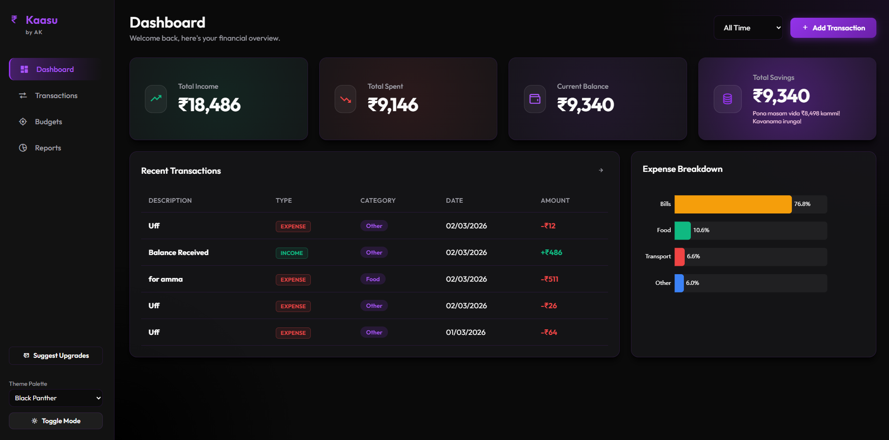
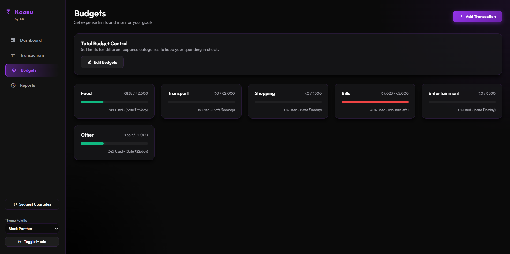
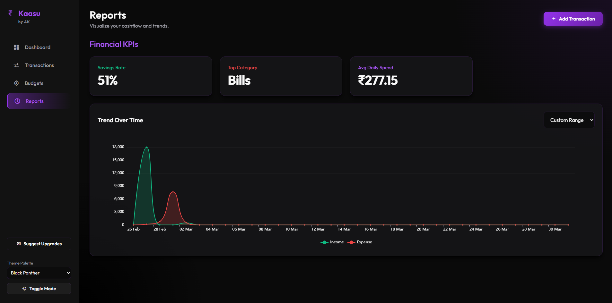

# 💰 Kaasu Premium Expense Tracker

**Kaasu Premium** is a sleek, privacy-focused financial management tool designed to help you take control of your spending. Built for simplicity and speed, it allows you to track accounts, manage liabilities, and visualize your financial health in real-time.

---

## 💎 Key Features

* **Comprehensive Cash Flow Management:** Take full command of your liquidity by monitoring income, tracking expenditures, and managing multi-account balances within a unified interface.
* **Advanced Visual Analytics:** Gain deep financial insights through dynamic dashboards with interactive charts for monthly spending trends and category-wise breakdowns.
* **Precision Budgeting & Goal Tracking:** Define custom monthly spending limits and establish long-term savings objectives with real-time progress indicators.
* **Professional Reporting:** Generate and export comprehensive monthly financial summaries in **PDF format** for archival or tax purposes.
* **Data Sovereignty:** Maintain full control with **CSV import/export** capabilities, allowing for seamless data migration or secure local backups.
* **Granular Temporal Insights:** Utilize high-fidelity timeline graphs to visualize day-wise expenditure fluctuations and optimize your spending cadence.
* **Privacy-Centric Architecture:** Experience a "Security-First" philosophy with cloud-syncing via Google Auth, ensuring no invasive SMS permissions or background monitoring.

---

## 🛠️ Tech Stack

* **Frontend:** React.js / Vite
* **Styling:** Tailwind CSS (or your specific UI library)
* **Backend/Auth:** Firebase / Supabase
* **Charts:** Recharts / Chart.js
* **Hosting:** Github and Netlify

---


## 🚀 Getting Started

To run this project locally, follow these steps:

1. **Clone the repository:**
   ```bash
   git clone [https://github.com/your-username/kaasu-premium.git](https://github.com/your-username/kaasu-premium.git)

   Gemini said
Since your tool is a clean, financial tracker, your README should reflect that same professional and minimalist energy. A great GitHub README serves as both a manual and a landing page for potential users (or recruiters!).

Here is a structured template tailored specifically for the Kaasu Premium Expense Tracker.

📝 Kaasu Premium README Template
Markdown
# 💰 Kaasu Premium Expense Tracker

**Kaasu Premium** is a sleek, privacy-focused financial management tool designed to help you take control of your spending. Built for simplicity and speed, it allows you to track accounts, manage liabilities, and visualize your financial health in real-time.

[🚀 Live Demo] (https://ajaykreigns.github.io/Kaasu-2.O-Premium-Expenses-Tracker/)

[🚀 Live Demo] (https://kaasu-premium-expense-tracker.netlify.app/)

---

## ✨ Key Features

* **Multi-Account Tracking:** Manage Cash, Bank, and Credit Card accounts in one place.
* **Liability Management:** Specialized tracking for credit cards and loans with automated balance updates.
* **Visual Analytics:** Dynamic charts for monthly spending trends and category-wise breakdowns.
* **Budgeting & Goals:** Set monthly limits and track your progress toward specific savings targets.
* **CSV Import/Export:** Seamlessly migrate your data or keep local backups.
* **Privacy First:** Cloud-synced via Google Auth without requiring invasive SMS permissions.

---

## 🛠️ Tech Stack

* **Frontend:** React.js / Vite
* **Styling:** Tailwind CSS (or your specific UI library)
* **Backend/Auth:** Firebase / Supabase
* **Charts:** Recharts / Chart.js
* **Hosting:** Netlify

---

📸 Screenshots






Transaction History
🛡️ Privacy & Security
Kaasu Premium does not read your SMS or personal messages. All data is securely stored and accessible only via your authenticated Google account.

🤝 Contributing
Contributions are welcome! Please open an issue or submit a pull request for any features or bug fixes.

---

## 📄 License

This project is specialized for premium financial tracking and is distributed under the **MIT License**.

For more details, please see the [official LICENSE file] (https://github.com/AjayKreigns/Kaasu-2.O-Premium-Expenses-Tracker/blob/main/LICENSE)
